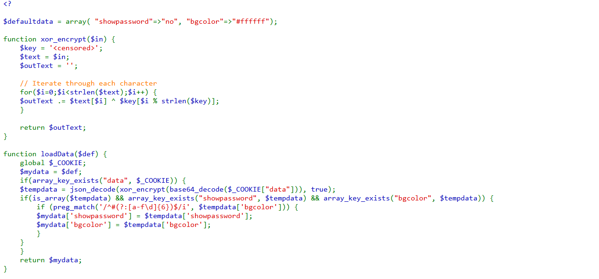

# OverTheWire Natas Walkthrough: Level 10 → Level 11

## Challenge Description
The goal of Level 11 is to exploit a vulnerability in the search form to retrieve the password for Level 12.

* **URL:** http://natas11.natas.labs.overthewire.org
* **Username:** natas11

---

## Walkthrough

### 1. Analyzing the Interface
Upon logging in, we are presented with a simple search form that looks for words in a dictionary:
``` text
Cookies are protected with XOR encryption
Background color:[#ffffff__________]Set Color
                                       View SourceCode
```
### 2. Finding Vulnerabilities
on just presssing set color, we gte similar text as previous level
``` text
Warning: preg_match(): Allocation of JIT memory failed, PCRE JIT will be disabled. This is likely caused by security restrictions. Either grant PHP permission to allocate executable memory, or set pcre.jit=0 in /var/www/natas/natas11/index.php on line 34
```
On view source code, we get to understand that we need to manipulate cookies to force show password to be yes


### 3. Exploitation
We get to cookies section in developer tools
We find that cookies are hex coded

### 3. Exploitation (Continued)
The source code reveals that the application tracks user preferences via a cookie named `data`. This cookie contains an array that is serialized into JSON, encrypted using a repeating XOR key, and finally encoded in Base64 before being sent to the browser. 

Because XOR is symmetric, we can exploit the following mathematical relationship:
Plaintext XOR Ciphertext = Key

By taking the default JSON string and XORing it with the decoded original cookie found in DevTools, we extract the server's secret key: `kBSw`.

Using this key, we craft a forged JSON payload changing `"showpassword":"no"` to `"showpassword":"yes"`. 

#### The Exploit Payload
* **Target JSON:** {"showpassword":"yes","bgcolor":"#ffffff"}
* **XOR Key:** kBSw
* **Resulting Exploitation Cookie:** EGAgHwQ1IxYYMSQYGSZxTUk7NgRJbnEVDCE8GwQwcU1JYTURDSQ1EUk/

### 4. Retrieving the Flag
To execute the exploit without letting the application overwrite your injected cookie via the "Set Color" form submission:

1. Open your browser's Developer Tools (F12) and head to the Console tab.
2. Inject the forged cookie directly into your document context by running the following command:
   ```javascript
   document.cookie = "data=EGAgHwQ1IxYYMSQYGSZxTUk7NgRJbnEVDCE8GwQwcU1JYTURDSQ1EUk/; path=/";
3.Refresh the page and the password will be printed 