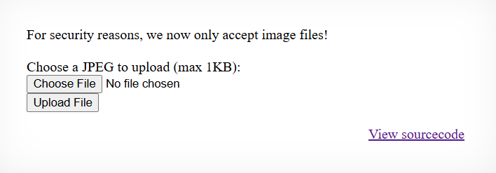

================================================================================
# OverTheWire Natas Walkthrough: Level 12 → Level 13
================================================================================

## Challenge Description
The goal of Level 12 is to exploit an unrestricted file upload vulnerability to execute arbitrary PHP commands and read the password for Level 13.

* **URL:** http://natas13.natas.labs.overthewire.org
* **Username:** natas13

---

## Walkthrough

### 1. Analyzing the Interface
We get to see the following

as we can see here, we can choose and upload a jpeg file or see the source code

### 2. Fidnding Vulnerabilities
We see the soruce code and find out 
 ->the extension of the file can be controlled by the user 
 ->it is possible to have the initial meta data as gif/jpeg/jpg/png wtv is allowed with php commands followed

### 3. The Exploit
To bypass the exif_imagetype() restriction and achieve Remote Code Execution (RCE), we need to trick the server into thinking we are uploading a valid image while ensuring the server executes it as a PHP script.

#### Crafting the Payload File
We create a hybrid payload file locally. By starting the file with the text signature "GIF89a", the server's exif_imagetype() function identifies it as a valid GIF image. Immediately following those magic bytes, we insert our PHP command delivery system.

Run the following command in your terminal to generate the payload:

```bash
echo "GIF89a<?php echo passthru('cat /etc/natas_webpass/natas14'); ?>" > payload.php
```
#### Intercepting and Modifying the Request
The web form contains a hidden input field (filename) that automatically forces an image extension (e.g., .jpg). We must manipulate this field so the server preserves our .php extension when saving the file.

1. Open the Natas 13 webpage in your browser.
2. Right-click the "Upload File" button and select "Inspect" to open the browser Developer Tools.
3. Locate the hidden filename field in the HTML structure:
   <input type="hidden" name="filename" value="randomstring.jpg">
4. Double-click the value attribute and change it to "payload.php".
5. Click "Choose File", select your newly created payload.php file, and click "Upload Image".

---

### 4. Retrieving the Password

Once submitted, the application validates the fake magic bytes, accepts the payload, and processes your custom extension. The server will display a confirmation message with a link to your uploaded file:

"The file upload/[random_string].php has been uploaded."

Clicking the link requests the file from the web server. Because the file possesses a .php extension, the server processes the embedded code instead of serving it as static text. 

The output displays the raw "GIF89a" magic bytes closely followed by the contents of the read command
That would be your password
---